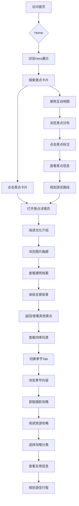

# 颐和园旅游介绍网站 - 产品需求文档

## 1. 产品概述

**项目名称**: 颐园印象 - 颐和园旅游介绍网站

**一句话简介**: 打造沉浸式皇家园林文化旅游数字平台,展示颐和园世界遗产价值与深厚历史文化底蕴。

**核心价值**: 
- 为计划游览颐和园的中外游客(25-55岁)提供全面的景点导览和旅游攻略
- 通过精美的视觉设计和创新的交互体验,传播中国皇家园林文化
- 满足文化爱好者、摄影爱好者、历史研究者和学生群体的深度学习需求

**主要使用场景**: 行前攻略规划、现场导览参考、文化深度学习、旅游分享

---

## 2. 核心功能模块

### 2.1 用户角色
本项目为面向公众的展示型网站,主要服务以下用户群体:

| 用户类型 | 使用场景 | 核心需求 |
|---------|---------|---------|
| 计划游客 | 行前规划 | 景点预览、门票信息、最佳游览路线 |
| 现场游客 | 实时导览 | 位置导航、景点详情、即时信息 |
| 文化爱好者 | 深度学习 | 历史背景、建筑特色、文化解读 |
| 摄影爱好者 | 拍摄参考 | 最佳机位、季节特色、摄影攻略 |
| 历史研究者 | 学术研究 | 文物档案、历史文献、专业资料 |

### 2.2 功能模块清单

#### 模块一:首页(Hero + Navigation)
- **全屏视差滚动Hero区域**: 展示佛香阁、昆明湖、长廊等标志性景观
- **固定顶部导航栏**: Logo、首页、景点介绍、互动地图、旅行攻略
- **品牌展示**: 主标题"颐和园" + 副标题"皇家园林 · 世界遗产 · 颐养太和"
- **快捷入口**: 开始游览、查看地图、旅游攻略按钮组
- **滚动提示**: 底部弹跳动画引导用户继续浏览

#### 模块二:景点卡片展示(CardStack)
- **扑克牌式堆叠效果**: 8张景点卡片垂直堆叠,模拟扑克牌视觉效果
- **交互翻页**: 鼠标滚轮/拖拽触发卡片翻页动画
- **洗牌动画**: CSS3 Transform 实现平滑的卡片切换效果
- **卡片内容**: 景点名称、简短描述、代表性图片
- **点击跳转**: 点击卡片在新标签页打开景点详情页

**8大核心景点清单**:
1. 佛香阁 - 全园标志建筑,八面三层四重檐结构
2. 长廊 - 世界最长画廊,彩画精美绝伦
3. 十七孔桥 - 金光穿洞奇观,十七个桥洞
4. 排云殿 - 慈禧太后庆寿之所,建筑群宏伟
5. 谐趣园 - 园中之园,荷塘假山精巧布局
6. 清晏舫(石舫) - 西洋风格石船建筑
7. 乐寿堂 - 慈禧寝宫,庭院玉兰闻名
8. 德和园大戏楼 - 清代三大戏台之一

#### 模块三:景点详情页(AttractionDetail)
- **路由设计**: /attraction/:id
- **页面结构**:
  - 景点大图Hero + 名称 + 一句话简介
  - 文化介绍区(历史背景、建筑特色、文化寓意)
  - 图片画廊(Grid布局 + Lightbox灯箱)
  - 实物档案(建筑参数、历史时间线、文物清单)
  - 街景实录(全景图展示,模拟街景效果)
  - 相关推荐(横向滚动卡片)
- **返回导航**: 顶部返回按钮

#### 模块四:互动地图导览(InteractiveMap)
- **手绘风格地图**: 颐和园景区底图作为背景
- **景点标注**: 8大景点在地图精确位置显示可点击图标
- **信息弹窗**: 点击标注弹出景点信息卡片
- **路线规划**: 选择起点和终点,显示推荐游览路线(SVG Path)
- **地图控制**: 缩放、拖拽、景点类型筛选(建筑/园林/水景)

#### 模块五:四季风景展示(SeasonalViews)
- **季节标签切换**: 春、夏、秋、冬四个季节Tab
- **季节内容展示**:
  - 代表性景观图片
  - 当季特色描述
  - 最佳游览时间建议
  - 摄影攻略提示
- **四季主题**:
  - 春: 西堤桃柳、知春亭山桃、昆明湖冰消
  - 夏: 谐趣园荷花、昆明湖泛舟、长廊听雨
  - 秋: 万寿山丹枫、满园桂香、金光穿洞
  - 冬: 佛香阁雪景、昆明湖冰场、踏雪寻梅

#### 模块六:旅游攻略(TravelGuide)
- **分类标签页**: 交通、美食、住宿、特产
- **实用信息卡片**: 分类展示各类攻略内容
- **攻略文章列表**: 精选攻略文章展示
- **常见问题FAQ**: 游客常见问题解答

---

## 3. 页面详细设计

### 3.1 首页布局

```
┌────────────────────────────────────────────┐
│ [Logo]  首页  景点介绍  互动地图  攻略     │ ← 固定导航栏
├────────────────────────────────────────────┤
│                                            │
│         [颐和园全景视差背景图]              │
│                                            │
│              颐和园                        │
│        皇家园林 · 世界遗产                  │
│                                            │
│    [开始游览]  [查看地图]  [旅游攻略]      │ ← CTA按钮组
│                                            │
│              ↓ 滚动提示                    │
│                                            │
├────────────────────────────────────────────┤
│                                            │
│     ┌─────────────────────────────┐        │
│     │   扑克牌式景点卡片堆叠区    │        │ ← 可翻页卡片
│     │   (8张卡片,当前卡片居中)    │        │
│     └─────────────────────────────┘        │
│                                            │
│         ○ ○ ● ○ ○ ○ ○ ○                   │ ← 页码指示器
│                                            │
├────────────────────────────────────────────┤
│        四季颐和园 · 春夏秋冬               │
│     [春] [夏] [秋] [冬]                    │ ← 季节Tab
│                                            │
│     ┌────┐ ┌────┐ ┌────┐ ┌────┐          │
│     │春季│ │夏季│ │秋季│ │冬季│          │
│     │图片│ │图片│ │图片│ │图片│          │ ← 季节图片
│     └────┘ └────┘ └────┘ └────┘          │
│                                            │
├────────────────────────────────────────────┤
│              页脚信息                      │
└────────────────────────────────────────────┘
```

### 3.2 景点详情页布局

```
┌────────────────────────────────────────────┐
│ [← 返回]  {景点名称}                       │ ← 顶部导航
├────────────────────────────────────────────┤
│                                            │
│         [景点全景大图 - 视差效果]          │ ← Hero Image
│                                            │
├────────────────────────────────────────────┤
│                                            │
│  {景点名称}  [标签1] [标签2] [标签3]       │
│  {一句话简介}                              │
│                                            │
│  ┌──────────────────────────────────────┐  │
│  │         文化介绍内容区               │  │
│  │  历史背景 · 建筑特色 · 文化意义      │  │
│  └──────────────────────────────────────┘  │
│                                            │
│  ┌────┐ ┌────┐ ┌────┐ ┌────┐             │
│  │图片│ │图片│ │图片│ │图片│  ← 图片画廊 │
│  └────┘ └────┘ └────┘ └────┘             │
│                                            │
│  ┌──────────────────────────────────────┐  │
│  │          建筑档案卡片                │  │
│  │  高度: XX米 | 面积: XX㎡ | 建于: XXX年 │  │ ← 实物档案
│  │  历史时间线                          │  │
│  └──────────────────────────────────────┘  │
│                                            │
│  ┌──────────────────────────────────────┐  │
│  │       [街景全景展示区域]              │  │ ← 街景实录
│  │       360度全景交互区域              │  │
│  └──────────────────────────────────────┘  │
│                                            │
│  相关推荐: [景点1] [景点2] [景点3]         │
│                                            │
└────────────────────────────────────────────┘
```

### 3.3 互动地图页布局

```
┌────────────────────────────────────────────┐
│ [Logo]  首页  景点介绍  互动地图  攻略     │
├────────────────────────────────────────────┤
│                                            │
│  ┌──────────────────────────────────────┐  │
│  │                                      │  │
│  │      [颐和园手绘风格地图]             │  │
│  │                                      │  │
│  │    📍        📍                     │  │
│  │         📍                          │  │ ← 地图交互区
│  │    📍         📍                    │  │
│  │      📍        📍                   │  │
│  │                                      │  │
│  └──────────────────────────────────────┘  │
│                                            │
│  [+] [-]  [全部] [建筑] [园林] [水景]     │ ← 控制栏
│                                            │
│  ┌──────────────────────────────────────┐  │
│  │ 📍 {景点名称}                        │  │
│  │ {景点简介}                           │  │ ← 景点信息卡
│  │ [查看详情]                           │  │
│  └──────────────────────────────────────┘  │
│                                            │
└────────────────────────────────────────────┘
```

---

## 4. UI设计规范

### 4.1 设计风格
**主题**: 新中式 + 现代简约

**设计理念**:
- 色彩运用: 以中国传统色彩为主,朱红、琉璃黄、墨绿、象牙白
- 字体选择: 标题使用书法字体(方正清刻本悦宋/Noto Serif SC),正文使用现代无衬线字体
- 空间布局: 大量留白,营造园林"移步换景"的空间感
- 质感表现: 轻微阴影、圆角、纸质纹理背景

### 4.2 色彩方案

```css
:root {
  /* 主色调 - 皇家红 */
  --primary: #8B1A1A;              /* 深红,主按钮、重点强调 */
  --primary-light: #B85450;        /* 浅红,悬浮状态 */
  --primary-dark: #5C0F0F;         /* 暗红,按下状态 */
  
  /* 辅助色 - 琉璃黄 */
  --accent: #D4A574;               /* 琉璃黄,次要强调 */
  --accent-light: #E8C9A0;          /* 浅黄,装饰元素 */
  
  /* 自然色 */
  --green: #2D5A3D;                /* 园林绿,自然主题 */
  --lake-blue: #4A7C8C;            /* 昆明湖蓝,水景主题 */
  
  /* 中性色 */
  --bg-primary: #F5F0E8;            /* 宣纸米,主背景 */
  --bg-secondary: #FFFFFF;          /* 纯白,卡片背景 */
  --text-primary: #2C2C2C;          /* 深灰,主文字 */
  --text-secondary: #666666;        /* 中灰,次要文字 */
  --border: #E0D5C5;                /* 浅褐,边框线条 */
  
  /* 功能色 */
  --success: #2D5A3D;              /* 成功状态 */
  --warning: #D4A574;              /* 警告状态 */
  --error: #8B1A1A;                /* 错误状态 */
}
```

### 4.3 字体系统

```css
/* 标题字体 - 书法风格 */
font-family: 'Noto Serif SC', 'Songti SC', 'SimSun', serif;

/* 正文字体 - 现代无衬线 */
font-family: 'Noto Sans SC', -apple-system, BlinkMacSystemFont, sans-serif;

/* 字号规范 */
--text-xs: 12px;      /* 辅助说明 */
--text-sm: 14px;      /* 次要内容 */
--text-base: 16px;    /* 正文内容 */
--text-lg: 18px;      /* 强调内容 */
--text-xl: 20px;      /* 章节标题 */
--text-2xl: 24px;     /* 页面标题 */
--text-3xl: 30px;     /* Hero标题 */
--text-4xl: 36px;     /* 大标题 */

/* 行高规范 */
--leading-tight: 1.25;   /* 紧凑行高 */
--leading-normal: 1.5;    /* 正常行高 */
--leading-relaxed: 1.75; /* 宽松行高 */
```

### 4.4 组件样式

#### 按钮样式
- **主按钮**: 
  - 背景: `var(--primary)`, 文字: 白色
  - 圆角: `8px`, 内边距: `12px 24px`
  - 悬浮: 背景变亮 `var(--primary-light)`
  - 动画: `transition: all 0.3s ease`

- **次按钮**: 
  - 背景: 透明, 边框: `2px solid var(--primary)`
  - 文字: `var(--primary)`
  - 悬浮: 背景填充 `var(--primary)`, 文字变白

- **幽灵按钮**: 
  - 无背景无边框
  - 悬浮: 底部显示下划线动画

#### 卡片样式
- **景点卡片**:
  - 比例: 16:9
  - 圆角: `16px`
  - 阴影: `0 4px 20px rgba(0,0,0,0.1)`
  - 悬浮: `transform: scale(1.02)`, 阴影加深

- **信息卡片**:
  - 背景: `var(--bg-secondary)`
  - 圆角: `12px`
  - 内边距: `24px`
  - 阴影: `0 2px 8px rgba(0,0,0,0.08)`
  - 悬浮: 阴影加深

#### 导航栏样式
- **样式**: 固定顶部,高度 `64px`
- **背景**: 透明 → 滚动后 `rgba(245,240,232,0.95)` + 毛玻璃效果
- **Logo**: 左侧,高度 `40px`
- **链接**: 右侧,间距 `32px`

### 4.5 动画规范

#### 页面入场动画
```css
/* 标题动画 - 从下往上淡入 */
@keyframes fadeInUp {
  from {
    opacity: 0;
    transform: translateY(30px);
  }
  to {
    opacity: 1;
    transform: translateY(0);
  }
}

/* 延迟配置 */
.title { animation: fadeInUp 0.6s ease-out 0.3s both; }
.subtitle { animation: fadeInUp 0.6s ease-out 0.5s both; }
.cta-group { animation: fadeInUp 0.6s ease-out 0.7s both; }
```

#### 卡片翻页动画
```css
/* 当前卡片 */
.current-card {
  transform: scale(1) translateY(0) rotate(0deg);
  z-index: 8;
  transition: all 0.5s cubic-bezier(0.4, 0, 0.2, 1);
}

/* 退出卡片 */
.exit-card-next {
  transform: translateX(100%) rotate(15deg);
  opacity: 0;
}

.exit-card-prev {
  transform: translateX(-100%) rotate(-15deg);
  opacity: 0;
}

/* 堆叠卡片 */
.stacked-card {
  position: absolute;
  transition: all 0.5s cubic-bezier(0.4, 0, 0.2, 1);
}
```

#### 悬浮交互动画
```css
/* 卡片悬浮 */
.card:hover {
  transform: translateY(-8px);
  box-shadow: 0 12px 40px rgba(0,0,0,0.15);
}

/* 按钮悬浮 */
.button:hover {
  transform: translateY(-2px);
  box-shadow: 0 4px 12px rgba(139,26,26,0.3);
}
```

---

## 5. 响应式设计

### 5.1 断点设置
```css
/* 移动端优先断点 */
--screen-sm: 640px;   /* 大手机 */
--screen-md: 768px;   /* 平板 */
--screen-lg: 1024px;  /* 小桌面 */
--screen-xl: 1280px;  /* 桌面 */
--screen-2xl: 1536px; /* 大桌面 */
```

### 5.2 适配策略

#### 桌面端 (≥1024px)
- 导航栏: 水平排列
- Hero区域: 全屏视差
- 卡片堆叠: 居中展示
- 地图: 全宽展示

#### 平板端 (768px - 1023px)
- 导航栏: 水平排列,间距缩小
- Hero区域: 全屏视差
- 卡片堆叠: 缩小比例
- 地图: 全宽展示,控件简化

#### 移动端 (<768px)
- 导航栏: 汉堡菜单
- Hero区域: 高度调整为 `100vh - 60px`
- 卡片堆叠: 全宽展示,滑动翻页
- 地图: 全宽展示,手势控制

### 5.3 移动端优化
- 触摸手势支持(滑动、捏合缩放)
- 按钮尺寸 ≥ `44px × 44px`
- 文字可缩放,但保持可读性
- 图片懒加载
- 减少动画复杂度以提升性能

---

## 6. 核心用户流程

### 6.1 主要用户流程

```
用户访问首页
    │
    ├── 了解颐和园概况 → 浏览Hero和品牌展示
    │
    ├── 探索景点 → 点击景点卡片浏览
    │       │
    │       ├── 滚轮翻页查看8大景点
    │       │
    │       └── 点击进入详情页
    │              │
    │              ├── 阅读文化介绍
    │              ├── 浏览图片画廊
    │              ├── 查看建筑档案
    │              ├── 体验全景街景
    │              │
    │              └── 返回首页/查看其他景点
    │
    ├── 使用地图导览 → 打开互动地图
    │       │
    │       ├── 浏览景点分布
    │       ├── 点击查看详情
    │       ├── 规划游览路线
    │       │
    │       └── 点击前往详情页
    │
    ├── 查看四季风景 → 浏览季节Tab
    │       │
    │       ├── 切换季节查看
    │       ├── 阅读季节特色
    │       │
    │       └── 获取摄影建议
    │
    └── 阅读旅游攻略 → 打开攻略页面
            │
            ├── 选择分类标签
            │   ├── 交通信息
            │   ├── 美食推荐
            │   ├── 住宿建议
            │   └── 特产购物
            │
            └── 查看攻略文章
```

### 6.2 交互流程图



---

## 7. 功能优先级

### 第一阶段:MVP核心功能
| 序号 | 功能模块 | 优先级 | 说明 |
|-----|---------|-------|------|
| 1 | 项目框架搭建 | P0 | React + Vite + TypeScript + Tailwind CSS |
| 2 | 首页Hero区域 | P0 | 视差背景、导航栏、品牌展示、CTA按钮 |
| 3 | 景点卡片堆叠 | P0 | 扑克牌式翻页效果,8大景点展示 |
| 4 | 景点详情页 | P0 | 基础内容展示模板 |
| 5 | 路由配置 | P0 | React Router页面路由 |

### 第二阶段:核心功能完善
| 序号 | 功能模块 | 优先级 | 说明 |
|-----|---------|-------|------|
| 6 | 互动地图 | P1 | 地图展示、景点标注、信息弹窗 |
| 7 | 四季风景模块 | P1 | 季节切换、图片展示 |
| 8 | 旅游攻略 | P1 | 攻略内容页面、分类展示 |

### 第三阶段:增强体验
| 序号 | 功能模块 | 优先级 | 说明 |
|-----|---------|-------|------|
| 9 | 街景功能 | P2 | 全景图展示集成 |
| 10 | 动画优化 | P2 | 页面过渡动画、微交互 |
| 11 | 响应式适配 | P2 | 移动端优化 |
| 12 | 性能优化 | P2 | 图片懒加载、代码分割 |

---

## 8. 成功指标

### 8.1 功能完成度
- [ ] 首页Hero动画效果正常
- [ ] 导航栏滚动效果正常
- [ ] 扑克牌式卡片堆叠翻页流畅
- [ ] 景点详情页内容完整展示
- [ ] 互动地图标记与交互正常
- [ ] 季节切换标签页功能正常
- [ ] 旅游攻略页面内容完整
- [ ] 响应式布局适配各设备

### 8.2 性能指标
- 首屏加载时间 < 3秒
- 页面切换动画流畅 (60fps)
- 图片懒加载正常
- 移动端触摸响应 < 100ms

### 8.3 用户体验
- 页面加载状态显示
- 错误处理友好提示
- 平滑滚动效果
- 键盘导航支持

---

*文档版本: v1.0*  
*创建时间: 2026-05-15*  
*文档状态: 待用户审核*
