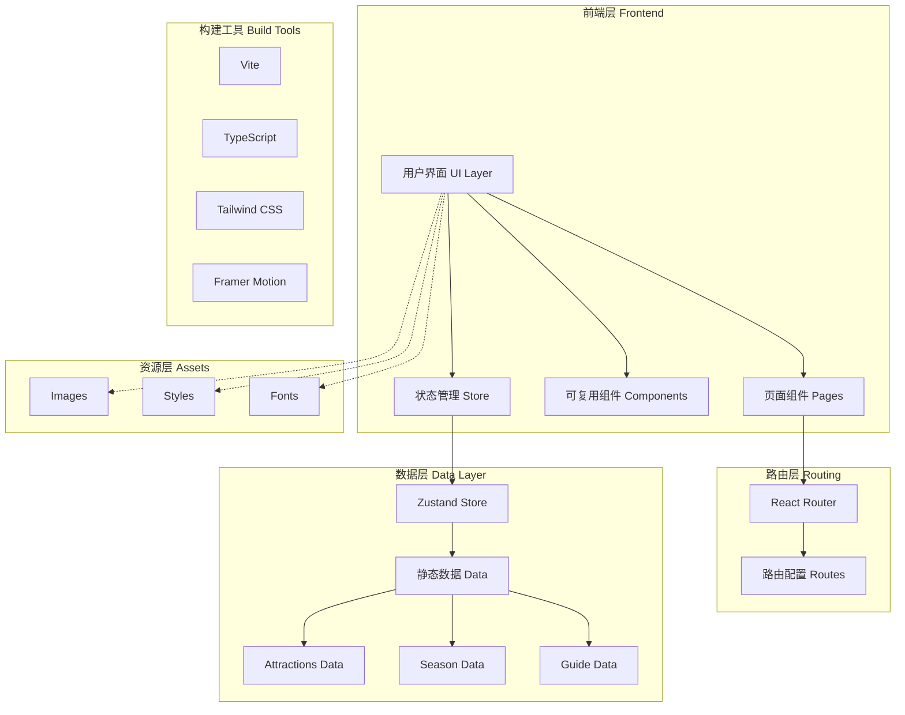
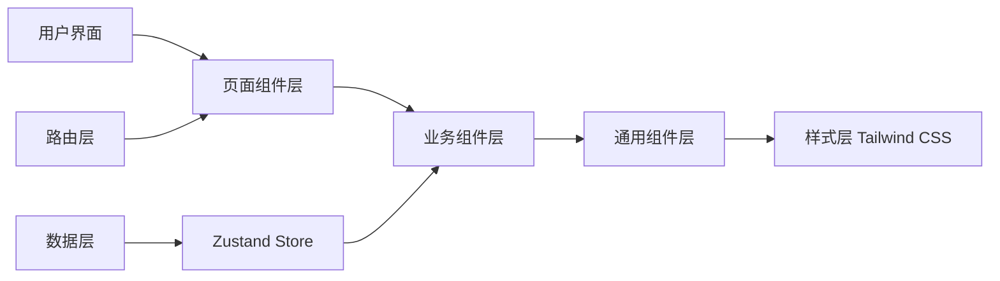
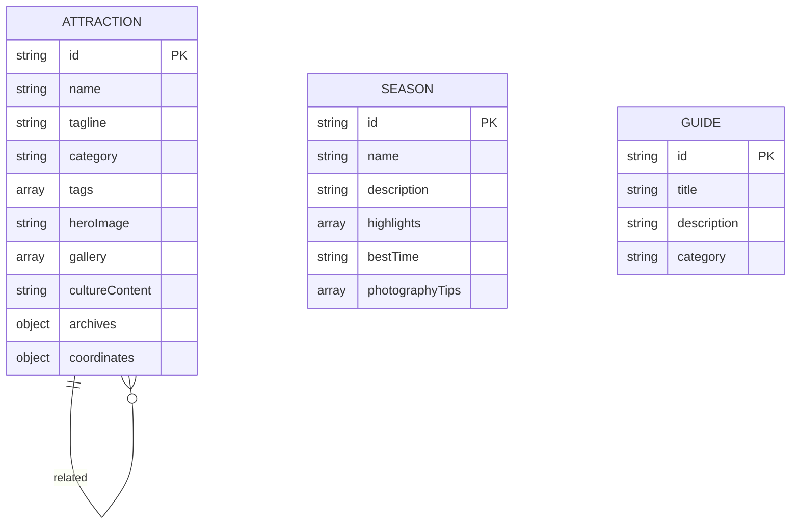

# 颐和园旅游介绍网站 - 技术架构文档

## 1. 架构设计概述

本项目采用现代化的前端技术栈,构建一个单页面应用(SPA),通过组件化和模块化的架构实现颐和园旅游介绍网站的各项功能。

### 1.1 系统架构图



### 1.2 目录结构

```
summer-palace-tourism/
├── public/
│   ├── images/
│   │   ├── attractions/       # 景点图片
│   │   ├── seasons/         # 四季图片
│   │   ├── map/              # 地图资源
│   │   └── icons/           # 图标资源
│   └── data/
│       └── attractions.json  # 景点数据JSON
│
├── src/
│   ├── components/           # 可复用组件
│   │   ├── common/           # 通用组件
│   │   │   ├── Navigation.tsx      # 导航栏
│   │   │   ├── Footer.tsx          # 页脚
│   │   │   ├── Button.tsx          # 按钮组件
│   │   │   └── Card.tsx            # 卡片组件
│   │   │
│   │   ├── home/             # 首页组件
│   │   │   ├── HeroSection.tsx      # Hero区域
│   │   │   ├── ScrollIndicator.tsx # 滚动提示
│   │   │   └── QuickEntry.tsx      # 快捷入口
│   │   │
│   │   ├── attractions/      # 景点组件
│   │   │   ├── CardStack.tsx       # 扑克牌堆叠
│   │   │   ├── AttractionCard.tsx   # 景点卡片
│   │   │   └── CardIndicator.tsx   # 卡片指示器
│   │   │
│   │   ├── map/              # 地图组件
│   │   │   ├── InteractiveMap.tsx   # 互动地图
│   │   │   ├── MapMarker.tsx        # 地图标记
│   │   │   └── RoutePath.tsx        # 路线绘制
│   │   │
│   │   └── seasons/          # 季节组件
│   │       ├── SeasonTabs.tsx       # 季节切换
│   │       └── SeasonCard.tsx       # 季节卡片
│   │
│   ├── pages/                # 页面组件
│   │   ├── Home.tsx                  # 首页
│   │   ├── AttractionDetail.tsx      # 景点详情
│   │   ├── InteractiveMapPage.tsx     # 地图导览页
│   │   ├── TravelGuide.tsx            # 旅游攻略页
│   │   └── NotFound.tsx               # 404页面
│   │
│   ├── hooks/                # 自定义Hooks
│   │   ├── useScrollAnimation.ts     # 滚动动画
│   │   ├── useCardStack.ts           # 卡片堆叠逻辑
│   │   └── useParallax.ts            # 视差效果
│   │
│   ├── store/                # 状态管理
│   │   └── attractionStore.ts        # 景点状态管理
│   │
│   ├── data/                 # 静态数据
│   │   ├── attractions.ts    # 景点数据
│   │   ├── seasons.ts        # 季节数据
│   │   └── guide.ts          # 攻略数据
│   │
│   ├── types/                # TypeScript类型
│   │   └── index.ts          # 类型定义
│   │
│   ├── styles/               # 样式文件
│   │   ├── globals.css       # 全局样式
│   │   └── variables.css     # CSS变量
│   │
│   ├── utils/                # 工具函数
│   │   └── helpers.ts        # 辅助函数
│   │
│   ├── App.tsx               # 根组件
│   └── main.tsx              # 入口文件
│
├── index.html                # HTML模板
├── package.json              # 项目配置
├── tsconfig.json             # TypeScript配置
├── tailwind.config.js        # Tailwind配置
├── vite.config.ts            # Vite配置
└── .gitignore               # Git忽略配置
```

---

## 2. 技术栈详解

### 2.1 核心技术选型

| 技术类别 | 选用方案 | 版本 | 说明 |
|---------|---------|------|------|
| **框架** | React | 18.x | 组件化开发,生态成熟 |
| **构建工具** | Vite | 5.x | 极速热更新,优化的构建 |
| **类型系统** | TypeScript | 5.x | 类型安全,代码提示 |
| **样式方案** | Tailwind CSS | 3.x | 原子化CSS,高度可定制 |
| **路由管理** | React Router | 6.x | 官方推荐,支持懒加载 |
| **状态管理** | Zustand | 4.x | 轻量级,简洁API |
| **动画库** | Framer Motion | 11.x | React最佳动画库 |
| **图标库** | Lucide React | 最新 | 现代化图标 |
| **全景展示** | Pannellum | 2.x | 轻量级360度全景 |

### 2.2 技术架构说明

#### 前端框架架构



#### 组件通信模式

```
父组件 → Props → 子组件
子组件 → 回调函数 → 父组件
组件 → Context/Zustand → 跨层级通信
```

---

## 3. 路由定义

### 3.1 路由配置表

| 路由路径 | 页面组件 | 功能描述 | 懒加载 |
|---------|---------|---------|-------|
| `/` | Home | 首页,包含Hero、景点卡片、四季展示 | 否 |
| `/attraction/:id` | AttractionDetail | 景点详情页 | 是 |
| `/map` | InteractiveMapPage | 互动地图导览页 | 是 |
| `/guide` | TravelGuide | 旅游攻略页 | 是 |
| `/*` | NotFound | 404页面 | 否 |

### 3.2 路由实现

```typescript
// src/App.tsx
import { BrowserRouter, Routes, Route } from 'react-router-dom';
import { lazy, Suspense } from 'react';

// 懒加载页面组件
const Home = lazy(() => import('./pages/Home'));
const AttractionDetail = lazy(() => import('./pages/AttractionDetail'));
const InteractiveMapPage = lazy(() => import('./pages/InteractiveMapPage'));
const TravelGuide = lazy(() => import('./pages/TravelGuide'));
const NotFound = lazy(() => import('./pages/NotFound'));

// Loading组件
const PageLoader = () => (
  <div className="min-h-screen flex items-center justify-center bg-[var(--bg-primary)]">
    <div className="animate-pulse text-[var(--primary)]">加载中...</div>
  </div>
);

function App() {
  return (
    <BrowserRouter>
      <Routes>
        <Route path="/" element={<Home />} />
        <Route 
          path="/attraction/:id" 
          element={
            <Suspense fallback={<PageLoader />}>
              <AttractionDetail />
            </Suspense>
          } 
        />
        <Route 
          path="/map" 
          element={
            <Suspense fallback={<PageLoader />}>
              <InteractiveMapPage />
            </Suspense>
          } 
        />
        <Route 
          path="/guide" 
          element={
            <Suspense fallback={<PageLoader />}>
              <TravelGuide />
            </Suspense>
          } 
        />
        <Route path="*" element={<NotFound />} />
      </Routes>
    </BrowserRouter>
  );
}

export default App;
```

---

## 4. 数据模型定义

### 4.1 核心数据类型

```typescript
// src/types/index.ts

// 景点分类枚举
export type AttractionCategory = 'building' | 'garden' | 'water' | 'culture';

// 景点数据模型
export interface Attraction {
  id: string;
  name: string;
  tagline: string;
  category: AttractionCategory;
  tags: string[];
  
  // 媒体资源
  heroImage: string;
  gallery: string[];
  panoramaUrl?: string;
  
  // 文化内容
  cultureContent: {
    history: string;
    architecture: string;
    significance: string;
  };
  
  // 档案数据
  archives: {
    height?: string;
    area?: string;
    builtYear?: string;
    rebuiltYear?: string;
    features: string[];
  };
  
  // 地图坐标
  coordinates: {
    x: number; // 百分比 0-100
    y: number; // 百分比 0-100
  };
  
  // 关联景点
  relatedIds: string[];
}

// 季节枚举
export type SeasonType = 'spring' | 'summer' | 'autumn' | 'winter';

// 季节亮点
export interface SeasonHighlight {
  title: string;
  description: string;
  image: string;
}

// 季节数据模型
export interface Season {
  id: SeasonType;
  name: string;
  nameEn: string;
  description: string;
  highlights: SeasonHighlight[];
  bestTime: string;
  photographyTips: string[];
}

// 攻略分类
export type GuideCategory = 'transport' | 'food' | 'accommodation' | 'souvenirs';

// 攻略项
export interface GuideItem {
  id: string;
  title: string;
  description: string;
  category: GuideCategory;
  icon?: string;
  details?: string[];
}

// 地图景点标记
export interface MapMarker {
  attractionId: string;
  position: { x: number; y: number };
  icon: string;
}
```

### 4.2 数据关系图



---

## 5. 组件架构设计

### 5.1 组件层次结构

```
App
├── Navigation (固定导航栏)
├── Routes
│   ├── Home
│   │   ├── HeroSection
│   │   │   ├── BackgroundImage
│   │   │   ├── Overlay
│   │   │   ├── Title
│   │   │   ├── Subtitle
│   │   │   ├── CTAButtons
│   │   │   └── ScrollIndicator
│   │   │
│   │   ├── CardStack
│   │   │   ├── AttractionCard (×8)
│   │   │   └── CardIndicator
│   │   │
│   │   └── SeasonTabs
│   │       ├── TabButton (×4)
│   │       └── SeasonCard
│   │
│   ├── AttractionDetail
│   │   ├── DetailHero
│   │   ├── IntroSection
│   │   ├── CultureSection
│   │   ├── ImageGallery
│   │   ├── ArtifactArchive
│   │   ├── StreetView
│   │   └── RelatedAttractions
│   │
│   ├── InteractiveMapPage
│   │   ├── InteractiveMap
│   │   │   ├── MapBackground
│   │   │   ├── MapMarker (×8)
│   │   │   └── RoutePath
│   │   ├── MapControls
│   │   └── AttractionPopup
│   │
│   └── TravelGuide
│       ├── GuideTabs
│       └── GuideCard (×n)
│
└── Footer
```

### 5.2 关键组件设计

#### 景点卡片堆叠组件

```typescript
// src/components/attractions/CardStack.tsx
import { useState, useRef, useEffect } from 'react';
import { motion, useMotionValue, useTransform, AnimatePresence } from 'framer-motion';
import AttractionCard from './AttractionCard';
import CardIndicator from './CardIndicator';
import { Attraction } from '../../types';

interface CardStackProps {
  attractions: Attraction[];
  onCardClick: (id: string) => void;
}

export default function CardStack({ attractions, onCardClick }: CardStackProps) {
  const [currentIndex, setCurrentIndex] = useState(0);
  const constraintsRef = useRef(null);

  // 计算卡片堆叠位置
  const getCardTransform = (index: number, current: number) => {
    const offset = index - current;
    
    if (offset === 0) {
      return { 
        x: 0, 
        y: 0, 
        rotate: 0, 
        scale: 1,
        zIndex: attractions.length 
      };
    }
    
    return {
      x: 0,
      y: Math.min(offset * 10, 70),
      rotate: offset * 1.5,
      scale: 1 - Math.abs(offset) * 0.02,
      zIndex: attractions.length - Math.abs(offset)
    };
  };

  // 处理滚轮事件
  const handleWheel = (e: WheelEvent) => {
    e.preventDefault();
    
    if (e.deltaY > 0 && currentIndex < attractions.length - 1) {
      setCurrentIndex(prev => prev + 1);
    } else if (e.deltaY < 0 && currentIndex > 0) {
      setCurrentIndex(prev => prev - 1);
    }
  };

  useEffect(() => {
    const container = constraintsRef.current;
    if (container) {
      container.addEventListener('wheel', handleWheel, { passive: false });
      return () => container.removeEventListener('wheel', handleWheel);
    }
  }, [currentIndex]);

  return (
    <div 
      ref={constraintsRef}
      className="relative w-full max-w-4xl h-[500px] mx-auto perspective-[1000px]"
    >
      <AnimatePresence mode="popLayout">
        {attractions.map((attraction, index) => {
          const transform = getCardTransform(index, currentIndex);
          
          return (
            <motion.div
              key={attraction.id}
              layout
              initial={false}
              animate={{
                x: transform.x,
                y: transform.y,
                rotate: transform.rotate,
                scale: transform.scale,
                zIndex: transform.zIndex
              }}
              transition={{
                type: "spring",
                stiffness: 300,
                damping: 30
              }}
              className="absolute w-full cursor-pointer"
              onClick={() => {
                if (index === currentIndex) {
                  onCardClick(attraction.id);
                } else {
                  setCurrentIndex(index);
                }
              }}
            >
              <AttractionCard attraction={attraction} />
            </motion.div>
          );
        })}
      </AnimatePresence>
      
      <CardIndicator 
        current={currentIndex} 
        total={attractions.length} 
      />
    </div>
  );
}
```

#### 互动地图组件

```typescript
// src/components/map/InteractiveMap.tsx
import { useState, useRef, useEffect } from 'react';
import { motion, AnimatePresence } from 'framer-motion';
import MapMarker from './MapMarker';
import AttractionPopup from './AttractionPopup';
import { Attraction } from '../../types';

interface InteractiveMapProps {
  attractions: Attraction[];
  onAttractionClick: (id: string) => void;
}

export default function InteractiveMap({ attractions, onAttractionClick }: InteractiveMapProps) {
  const [scale, setScale] = useState(1);
  const [position, setPosition] = useState({ x: 0, y: 0 });
  const [isDragging, setIsDragging] = useState(false);
  const [selectedAttraction, setSelectedAttraction] = useState<Attraction | null>(null);
  const mapRef = useRef<HTMLDivElement>(null);

  // 缩放处理
  const handleZoom = (delta: number) => {
    setScale(prev => Math.min(Math.max(prev + delta, 0.5), 3));
  };

  // 拖拽处理
  const handleMouseDown = () => setIsDragging(true);
  const handleMouseUp = () => setIsDragging(false);
  const handleMouseMove = (e: React.MouseEvent) => {
    if (isDragging) {
      setPosition(prev => ({
        x: prev.x + e.movementX,
        y: prev.y + e.movementY
      }));
    }
  };

  // 标记点击
  const handleMarkerClick = (attraction: Attraction) => {
    setSelectedAttraction(attraction);
  };

  return (
    <div className="relative w-full h-[600px] bg-[var(--bg-secondary)] rounded-2xl overflow-hidden shadow-lg">
      {/* 地图容器 */}
      <div
        ref={mapRef}
        className={`w-full h-full ${isDragging ? 'cursor-grabbing' : 'cursor-grab'}`}
        onMouseDown={handleMouseDown}
        onMouseUp={handleMouseUp}
        onMouseMove={handleMouseMove}
        onMouseLeave={handleMouseUp}
      >
        <motion.div
          className="relative w-full h-full"
          style={{
            transform: `scale(${scale}) translate(${position.x}px, ${position.y}px)`,
            transformOrigin: 'center center'
          }}
        >
          {/* 地图背景 */}
          <div className="absolute inset-0 bg-cover bg-center bg-no-repeat"
               style={{ backgroundImage: 'url(/images/map-summer-palace.svg)' }} />
          
          {/* 景点标记 */}
          {attractions.map(attr => (
            <MapMarker
              key={attr.id}
              attraction={attr}
              position={attr.coordinates}
              onClick={() => handleMarkerClick(attr)}
            />
          ))}
        </motion.div>
      </div>

      {/* 缩放控制 */}
      <div className="absolute bottom-4 right-4 flex flex-col gap-2">
        <button
          onClick={() => handleZoom(0.2)}
          className="w-10 h-10 bg-white rounded-lg shadow-md hover:bg-gray-50 transition-colors"
        >
          +
        </button>
        <button
          onClick={() => handleZoom(-0.2)}
          className="w-10 h-10 bg-white rounded-lg shadow-md hover:bg-gray-50 transition-colors"
        >
          −
        </button>
      </div>

      {/* 景点信息弹窗 */}
      <AnimatePresence>
        {selectedAttraction && (
          <AttractionPopup
            attraction={selectedAttraction}
            onClose={() => setSelectedAttraction(null)}
            onViewDetails={() => onAttractionClick(selectedAttraction.id)}
          />
        )}
      </AnimatePresence>
    </div>
  );
}
```

---

## 6. 状态管理设计

### 6.1 Zustand Store 结构

```typescript
// src/store/attractionStore.ts
import { create } from 'zustand';
import { Attraction, Season } from '../types';
import { attractions as attractionsData } from '../data/attractions';
import { seasons as seasonsData } from '../data/seasons';

interface AttractionState {
  // 景点数据
  attractions: Attraction[];
  currentAttraction: Attraction | null;
  
  // 季节数据
  seasons: Season[];
  currentSeason: Season;
  
  // UI状态
  selectedCategory: string | null;
  isMapOpen: boolean;
  
  // Actions
  setCurrentAttraction: (id: string) => void;
  setCurrentSeason: (seasonId: Season['id']) => void;
  setSelectedCategory: (category: string | null) => void;
  toggleMap: () => void;
}

export const useAttractionStore = create<AttractionState>((set, get) => ({
  attractions: attractionsData,
  currentAttraction: null,
  seasons: seasonsData,
  currentSeason: seasonsData[0],
  selectedCategory: null,
  isMapOpen: false,
  
  setCurrentAttraction: (id) => {
    const attraction = get().attractions.find(a => a.id === id);
    set({ currentAttraction: attraction || null });
  },
  
  setCurrentSeason: (seasonId) => {
    const season = get().seasons.find(s => s.id === seasonId);
    if (season) {
      set({ currentSeason: season });
    }
  },
  
  setSelectedCategory: (category) => {
    set({ selectedCategory: category });
  },
  
  toggleMap: () => {
    set(state => ({ isMapOpen: !state.isMapOpen }));
  },
}));
```

---

## 7. 样式架构设计

### 7.1 Tailwind CSS 配置

```javascript
// tailwind.config.js
/** @type {import('tailwindcss').Config} */
export default {
  content: [
    "./index.html",
    "./src/**/*.{js,ts,jsx,tsx}",
  ],
  theme: {
    extend: {
      colors: {
        // 主色调 - 皇家红
        primary: {
          DEFAULT: '#8B1A1A',
          light: '#B85450',
          dark: '#5C0F0F',
        },
        // 辅助色 - 琉璃黄
        accent: {
          DEFAULT: '#D4A574',
          light: '#E8C9A0',
        },
        // 自然色
        garden: '#2D5A3D',
        lake: '#4A7C8C',
        // 中性色
        paper: '#F5F0E8',
        border: '#E0D5C5',
      },
      fontFamily: {
        serif: ['Noto Serif SC', 'Songti SC', 'SimSun', 'serif'],
        sans: ['Noto Sans SC', '-apple-system', 'BlinkMacSystemFont', 'sans-serif'],
      },
      spacing: {
        '18': '4.5rem',
        '88': '22rem',
      },
      borderRadius: {
        '2xl': '1rem',
        '3xl': '1.5rem',
      },
      boxShadow: {
        'card': '0 4px 20px rgba(0, 0, 0, 0.1)',
        'card-hover': '0 12px 40px rgba(0, 0, 0, 0.15)',
      },
      animation: {
        'fade-in-up': 'fadeInUp 0.6s ease-out',
        'bounce-slow': 'bounce 2s infinite',
      },
      keyframes: {
        fadeInUp: {
          '0%': { opacity: '0', transform: 'translateY(30px)' },
          '100%': { opacity: '1', transform: 'translateY(0)' },
        },
      },
    },
  },
  plugins: [],
}
```

### 7.2 全局样式

```css
/* src/styles/globals.css */
@tailwind base;
@tailwind components;
@tailwind utilities;

/* CSS变量定义 */
:root {
  /* 主色调 */
  --primary: #8B1A1A;
  --primary-light: #B85450;
  --primary-dark: #5C0F0F;
  
  /* 辅助色 */
  --accent: #D4A574;
  --accent-light: #E8C9A0;
  
  /* 自然色 */
  --green: #2D5A3D;
  --lake-blue: #4A7C8C;
  
  /* 中性色 */
  --bg-primary: #F5F0E8;
  --bg-secondary: #FFFFFF;
  --text-primary: #2C2C2C;
  --text-secondary: #666666;
  --border: #E0D5C5;
}

/* 基础样式 */
@layer base {
  html {
    @apply scroll-smooth;
  }
  
  body {
    @apply bg-paper text-gray-800 font-sans antialiased;
  }
  
  h1, h2, h3, h4, h5, h6 {
    @apply font-serif;
  }
}

/* 组件样式 */
@layer components {
  /* 按钮 */
  .btn-primary {
    @apply bg-primary text-white px-6 py-3 rounded-lg 
           hover:bg-primary-light transition-all duration-300
           hover:-translate-y-0.5 hover:shadow-lg;
  }
  
  .btn-secondary {
    @apply bg-transparent border-2 border-primary text-primary
           px-6 py-3 rounded-lg hover:bg-primary hover:text-white
           transition-all duration-300;
  }
  
  /* 卡片 */
  .card {
    @apply bg-white rounded-2xl p-6 shadow-card
           hover:shadow-card-hover transition-shadow duration-300;
  }
  
  /* 导航 */
  .nav-link {
    @apply relative text-gray-700 hover:text-primary
           transition-colors duration-200;
  }
  
  .nav-link::after {
    @apply content-[''] absolute bottom-0 left-0 w-0 h-0.5
           bg-primary transition-all duration-300;
  }
  
  .nav-link:hover::after {
    @apply w-full;
  }
}

/* 工具样式 */
@layer utilities {
  /* 文字渐变 */
  .text-gradient {
    @apply bg-clip-text text-transparent
           bg-gradient-to-r from-primary to-accent;
  }
  
  /* 纸质纹理 */
  .paper-texture {
    background-image: url("data:image/svg+xml,%3Csvg viewBox='0 0 200 200' xmlns='http://www.w3.org/2000/svg'%3E%3Cfilter id='noiseFilter'%3E%3CfeTurbulence type='fractalNoise' baseFrequency='0.65' numOctaves='3' stitchTiles='stitch'/%3E%3C/filter%3E%3Crect width='100%25' height='100%25' filter='url(%23noiseFilter)'/%3E%3C/svg%3E");
    @apply opacity-5 pointer-events-none;
  }
  
  /* 视差效果 */
  .parallax-bg {
    @apply fixed inset-0 -z-10;
    background-attachment: fixed;
    background-size: cover;
    background-position: center;
  }
}
```

---

## 8. 性能优化策略

### 8.1 代码分割策略

```typescript
// 使用 React.lazy 进行路由级别的代码分割
const Home = lazy(() => import('./pages/Home'));
const AttractionDetail = lazy(() => import('./pages/AttractionDetail'));
const InteractiveMapPage = lazy(() => import('./pages/InteractiveMapPage'));
const TravelGuide = lazy(() => import('./pages/TravelGuide'));
```

### 8.2 图片优化策略

```typescript
// 图片懒加载组件
export const LazyImage = ({ src, alt, className }: LazyImageProps) => {
  const [isLoaded, setIsLoaded] = useState(false);
  const [isInView, setIsInView] = useState(false);
  const imgRef = useRef<HTMLDivElement>(null);

  useEffect(() => {
    const observer = new IntersectionObserver(
      ([entry]) => {
        if (entry.isIntersecting) {
          setIsInView(true);
          observer.disconnect();
        }
      },
      { rootMargin: '100px' }
    );

    if (imgRef.current) {
      observer.observe(imgRef.current);
    }

    return () => observer.disconnect();
  }, []);

  return (
    <div ref={imgRef} className={className}>
      {isInView && (
         setIsLoaded(true)}
        />
      )}
    </div>
  );
};
```

### 8.3 动画性能优化

```typescript
// 使用 will-change 优化动画性能
.card {
  will-change: transform;
  transform: translateZ(0);
}

// 使用 CSS containment
.map-container {
  contain: layout paint;
}
```

---

## 9. 部署架构

### 9.1 构建配置

```typescript
// vite.config.ts
import { defineConfig } from 'vite';
import react from '@vitejs/plugin-react';
import path from 'path';

export default defineConfig({
  plugins: [react()],
  resolve: {
    alias: {
      '@': path.resolve(__dirname, './src'),
    },
  },
  build: {
    rollupOptions: {
      output: {
        manualChunks: {
          vendor: ['react', 'react-dom', 'react-router-dom'],
          animation: ['framer-motion'],
        },
      },
    },
  },
  server: {
    port: 3000,
  },
});
```

### 9.2 环境变量

```bash
# .env.example
VITE_APP_TITLE=颐园印象
VITE_API_BASE_URL=https://api.example.com
VITE_MAP_TILE_URL=https://tile.openstreetmap.org/{z}/{x}/{y}.png
```

---

*文档版本: v1.0*  
*创建时间: 2026-05-15*  
*文档状态: 待用户审核*
